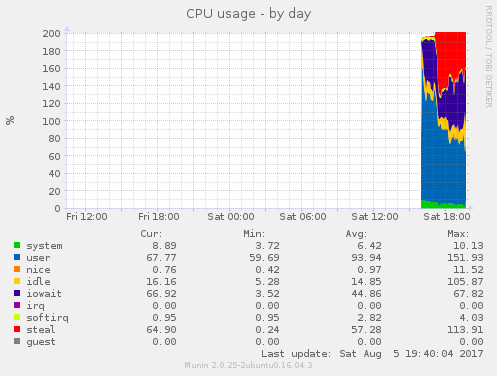
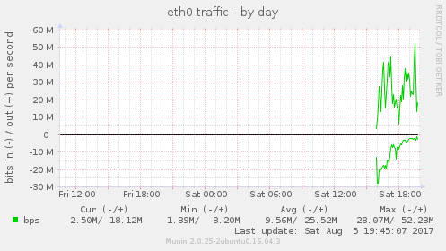
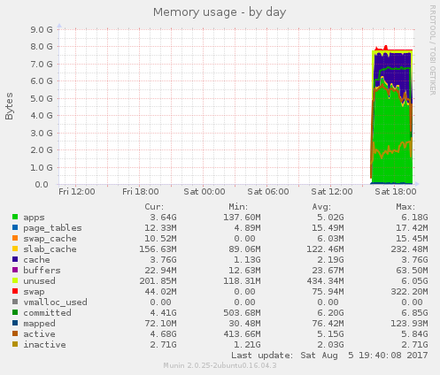
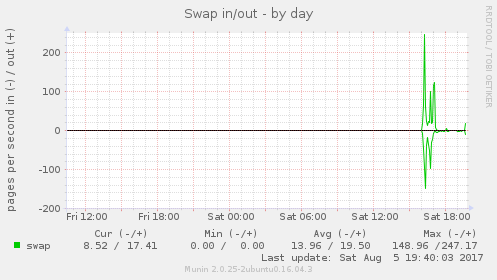

# Ethereum On AWS

This repo contains Terraform and Ansible files to set up an AWS EC2 instance to run Ethereum's <a href="https://github.com/ethereum/go-ethereum/wiki/geth">Geth client</a>.  
This was a proof of concept that I did to see if such a thing was really possible.  Sad news: 
it's non-trivial to pull off, because with 4.1 million Ethereum blocks as of this writing, it takes many 
many hours for the node to sync up with the full block chain. <a href="#note1">[1]</a>  

That said, I still wanted to publish this so that others may perhaps benefit from it.

## Prerequisites

- An Amazon Web Services account
- The <a href="https://aws.amazon.com/cli/">AWS CLI Tool</a> set up and configured with keys. (the tool is not used for this project, but Terraform will look for those keys)
- A DNS zone hosted in AWS Route 53
- <a href="https://www.terraform.io/">Terraform</a> installed on your machine
- <a href="https://www.ansible.com/">Ansible</a> installed on your machine

## Configuration

- Clone this repo
- Create a VPC by hand in your AWS account and note the ID
- Edit the file `terraform/variables-local.tf` and add in the following
   - Your VPC ID
   - Your EC2 SSH key ID
   - A name for an S3 bucket to create
   - A name for an S3 bucket where Cloudtrail will store logs (you log all of your S3 accesses, right?  Right??)
   - A logging prefix in the S3 bucket where Cloudtrail stores logs, unique to this bucket
   - Your DNS Zone ID
   - The DNS hostname to create
-  Edit the file `ansible/inventory` and change `eth1.dmuth.org` to the name of the hostname you will create.

## Usage

- Initialize Terraform: 
   - `cd terraform`
   - `terraform init`
- Make sure Terraform will do what you want, with no complaints or errors: `terraform plan`
- Build your server: `terraform apply`
   - This will build an m2.large server, which has 2 cores and 8 GB of RAM, and will cost 9.4 cents per hour.
- Run Ansible to install Python on that server and then install Geth and configure that server:
   - `cd ansible`
   - `ansible-playbook -i ./inventory ./1-install-python.yml`
   - `ansible-playbook -i ./inventory ./2-ethereum.yml`

You can now SSH into the server.  I recommend starting up `tmux` and then running Geth as follows: 

`geth --rpc --fast -cache=2048 --maxpeers=500`

To monitor the status of Geth while it is running, I recommend this command:

`while true; do  echo "eth.syncing" | geth attach; echo "admin.peers.length" | geth attach; sleep 30; done  | ts | tee output.txt`

## Saving Progress to S3

Part of the Terraform setup applies a role to the EC2 instance which will grant access to the S3 bucket 
which was created by Terraform.  If you want to save your progress with Geth between sessions, that 
can be done by using `aws s3 sync` to copy up the files and then copy them down after standing up a new machine.

## Monitoring Resource Usage

The Ansible playbook installs <a href="http://munin-monitoring.org/">Munin</a> on the server, and you 
can pull up the graphs by going to `http://hostname/munin/`.  This is useful to watch CPU usage, RAM usage,
and especially Swapfile usage.  If you notice the swapfile getting hammered, it probably means you need
more RAM. (took me several m2.small and m2.medium instances to figure THAT one out!)

### Actual Resource Graphs

Here are some actual resource graphs from running Geth on a m2.large instance:

The I/O Wait on our CPUs are increasing, which means we probably don't have enough RAM:

There is substantial network usage once the node starts acting like a peer and sending traffic out.
This is worth noting, as AWS charges 9 cents per GB out as of this writing:

RAM usage has actually gone down a bit, which I can't fully explain...

Swap isn't hit all that much, which is also a good sign:

Based on the above graphs, I would say that the I/O Wait is not due to excessive swap, but due to cache misses
either in Geth or in the system cache itself.  Running Geth with a larger `--cache` setting may help, possibly
at the expense of requiring an instance with more RAM.

## Finishing Up

- Run `terraform destroy` and then type `yes` to remove your EC2 instance, DNS name, and S3 bucket.
   - If you want to keep the S3 bucket, comment out the lines in that file first!

## So What Comes Next?

Ultimately, I was not sucessful at getting a fully functioning Ethereum node on my machine--at least
not to my satisfaction, as I was hoping to be able to send/receive from money and write some
<a href="https://solidity.readthedocs.io/">Solidity code</a>.

My next step will be to try <a href="https://parity.io/">the lightweight Parity client</a> and see 
if I have more luck with it.  Watch my GitHub repo and/or <a href="http://www.dmuth.org/">my blog</a> 
for more news on that front. :-)

## Footnotes

[1] <a href="#back1">^</a> But hey, I'm new to Ethereum, and maybe I did something wrong.  If that's the case, feel
free to open an issue on this project and let me know! 

